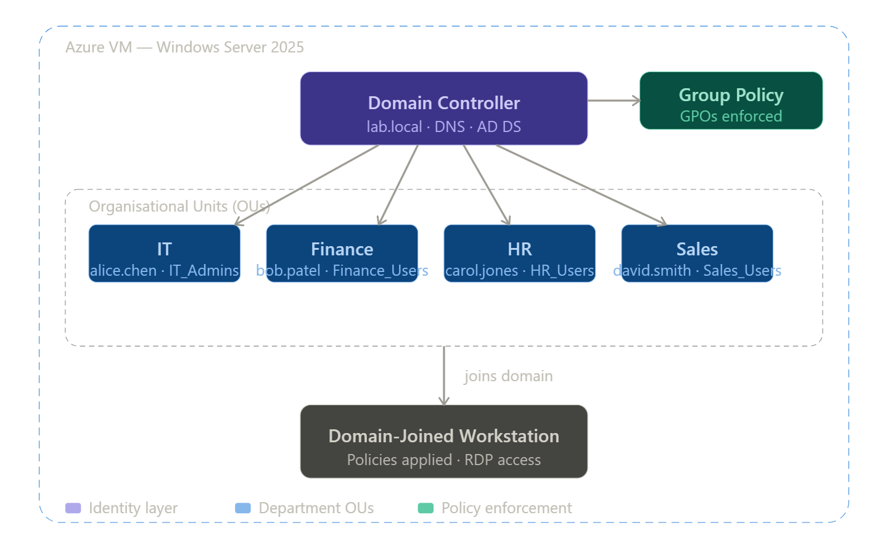
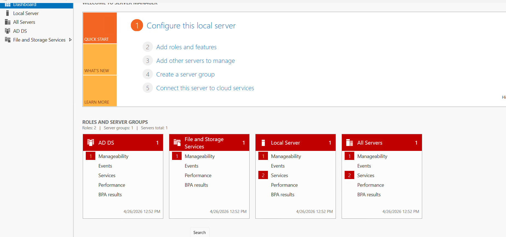
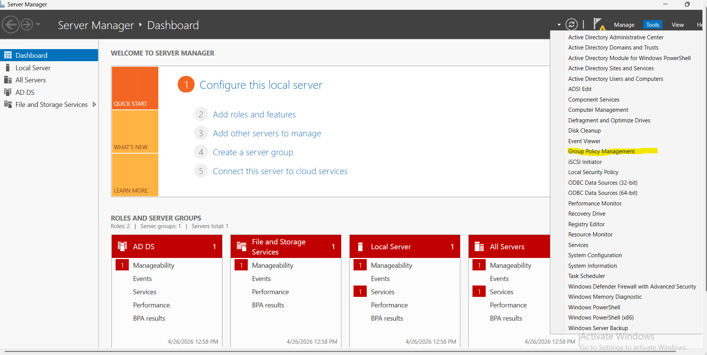
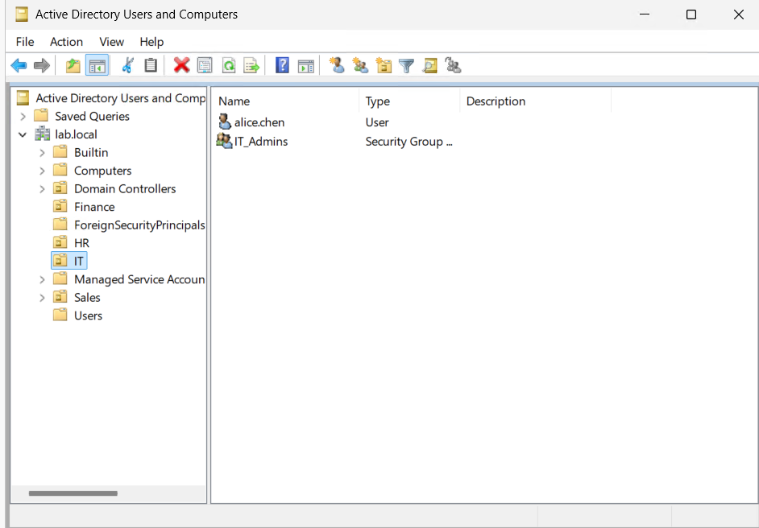
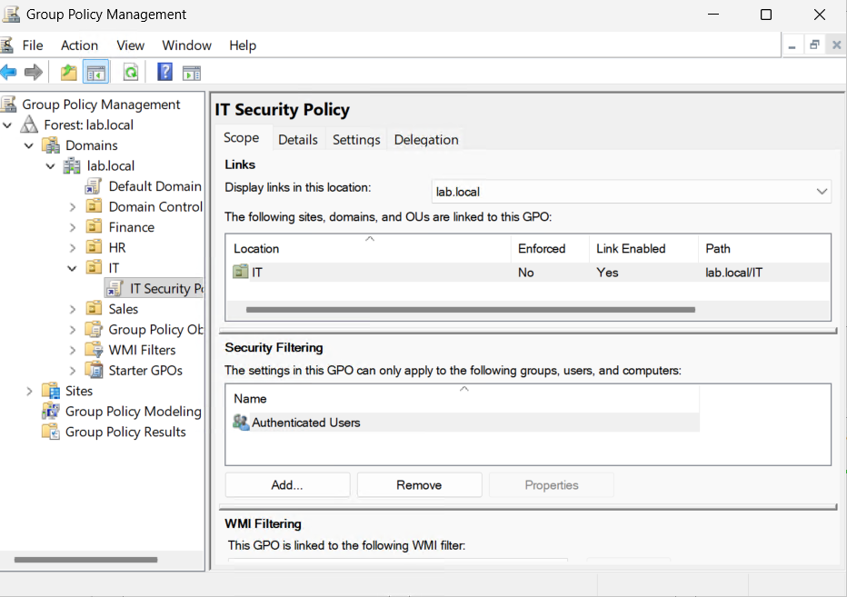
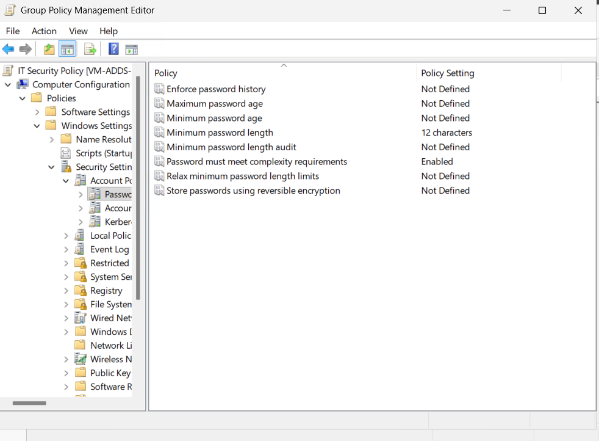
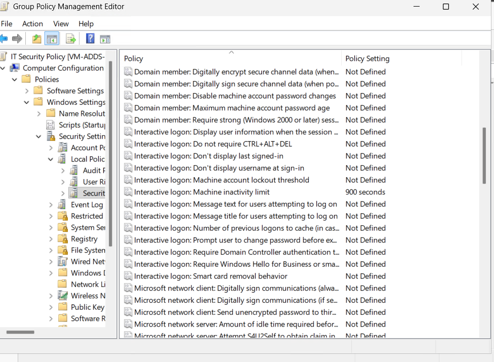
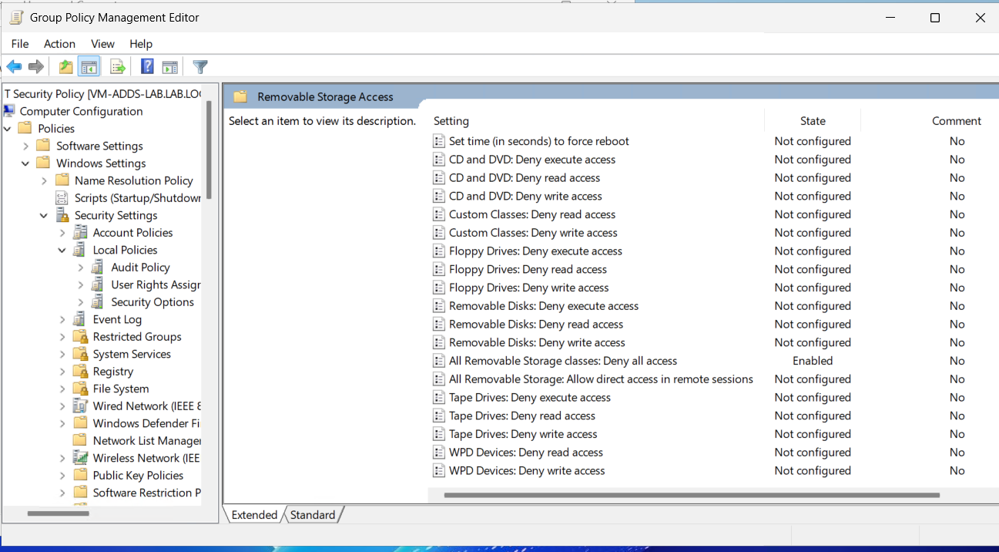
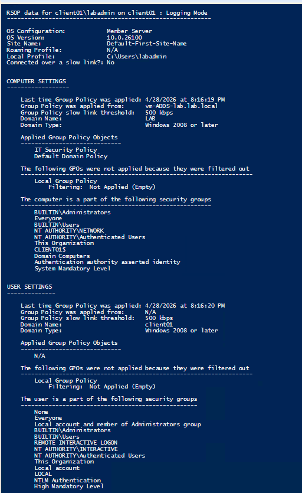
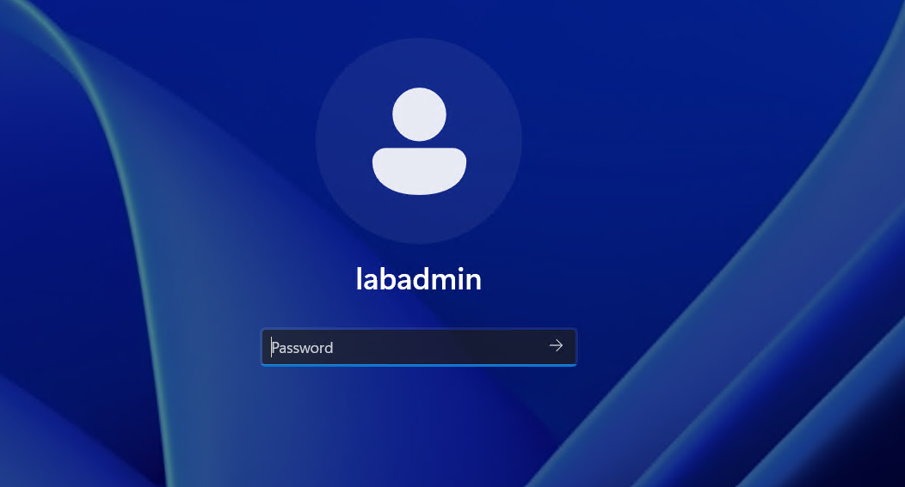

# Lab 1 — Active Directory
*Windows Server 2025 · Azure · Identity & Access Management*

| Field | Value |
|---|---|
| Certification alignment | CompTIA Network+ · Security+ · Azure Administrator |
| Free tools | Windows Server 2025 Evaluation (180 days) · Azure Free Account |
| Time to complete | 3–5 hours across multiple sessions |
| Estimated cost | $0 — fully covered by free tiers and evaluation licenses |
| Career relevance | IT Support · Sysadmin · Cloud Engineer · Security Analyst |

---

## What You Will Need

Before starting this lab you need **two virtual machines** in Azure. Both must be on the same VNet and subnet so they can communicate with each other.

| VM | Role | Purpose |
|---|---|---|
| vm-ADDS-lab | Domain Controller | Runs Active Directory, DNS, and Group Policy |
| client01 | Client workstation | Joins the domain and tests GPO application |

> **Important:** Create both VMs before starting the lab steps. The client VM settings are listed in Step 1 alongside the DC settings. Do not skip this — you will need it in Step 6.

---

## The Business Problem This Lab Solves

Every organization that runs Windows infrastructure — and the majority of enterprises do — relies on Active Directory to answer one fundamental question: **who is allowed to do what?**

Active Directory is the identity backbone. It controls which users can log into which computers, which groups can access which file shares, and which policies apply to which parts of the organization.

When a new employee joins, IT creates their account in Active Directory and adds them to the right groups. Their access to email, shared drives, printers, and applications is granted automatically based on group membership. When they leave, IT disables one account and every door closes simultaneously.

This is not legacy technology. Hybrid environments use Active Directory on-premises and sync identities to Microsoft Entra ID (formerly Azure AD) in the cloud. Understanding how to build and manage an Active Directory environment is foundational knowledge that applies directly to cloud roles.

| Role | How this lab applies |
|---|---|
| IT Support / Help Desk | Password resets, account unlocks, group membership changes — the top three ticket types in any enterprise |
| Sysadmin | Designing OU structure, deploying GPOs, managing domain-joined machines at scale |
| Cloud Engineer | Entra ID (cloud AD) uses the same concepts: users, groups, roles, conditional access. On-prem AD knowledge transfers directly |
| Security Analyst | AD is the most targeted system in ransomware attacks. Understanding how it works is the foundation of defending it |

---

## What You Will Learn

| Skill | Real-world application |
|---|---|
| Promote a Windows Server to Domain Controller | The first step in every enterprise Windows environment |
| Create Organizational Units (OUs) | OUs are the folders of Active Directory — they let you apply different policies to different departments |
| Create users, groups, and group memberships | Every access decision in an enterprise is group-based |
| Configure Group Policy Objects (GPOs) | Enforce settings across every machine in the domain centrally |
| Deploy and join a client VM to the domain | Connect a workstation so it becomes a managed, policy-enforced resource |
| Verify GPO application on a client machine | Confirm policies are actually applying to end user machines |
| Reset passwords and manage account lifecycle | The most frequent real-world task for IT support |

---

## Step 1 — Create Both VMs in Azure

You need two VMs before doing anything else. Create them both now so they are ready when you need them.



### Before you create either VM — note your VNet name

When you create the first VM Azure will create a VNet automatically. After creating the DC go to its **Networking** tab in the Azure portal and note the **Virtual network/subnet** name before creating client01.

---

### VM 1 — Domain Controller (vm-ADDS-lab)

Sign in to [portal.azure.com](https://portal.azure.com) → **Virtual Machines → Create**

| Setting | Value |
|---|---|
| Name | `vm-ADDS-lab` |
| Region | East US |
| Image | Windows Server 2025 Datacenter — Gen2 |
| Size | Standard_D2s_v3 (2 vCPU, 8GB RAM) |
| Username | your choice — write it down |
| Password | strong password — write it down |
| Public inbound ports | Allow RDP (3389) |
| OS disk | Standard SSD |

Click **Review + Create → Create** and wait for deployment to complete.

---

### VM 2 — Client Machine (client01)

Go to **Virtual Machines → Create** again.

| Setting | Value |
|---|---|
| Name | `client01` |
| Region | East US — must match DC |
| Image | **Windows Server 2025 Datacenter — Gen2** — do not select Linux |
| Size | Standard_D2s_v3 |
| Username | `labadmin` |
| Password | same password as DC |
| Public inbound ports | **Allow RDP (3389)** — must be selected |
| Virtual network | select the same VNet as vm-ADDS-lab |
| Subnet | select the same subnet as vm-ADDS-lab |

Click **Review + Create → Create** and wait for deployment to complete.

> **After client01 deploys — set DNS on the NIC before moving on.**
>
> 1. Go to **Virtual Machines → client01 → Networking → Network settings**
> 2. Click the NIC link at the top
> 3. In the left menu click **Settings → DNS Servers**
> 4. Switch from **Inherit from virtual network** to **Custom**
> 5. Enter the DC's private IP address
> 6. Click **Save**
> 7. Go back to **Virtual Machines → client01 → Restart**

---

### Enable clipboard for RDP on both VMs

1. Open **Remote Desktop** on your local machine
2. Enter the VM's public IP
3. Click **Show Options → Local Resources tab**
4. Make sure **Clipboard** is checked
5. Click **Connect**

---

## Step 2 — Install Active Directory Domain Services

RDP into **vm-ADDS-lab** using its public IP address. Open **Server Manager** — it opens automatically on login.

> **What is a Domain Controller?**
> A Domain Controller (DC) is a server that runs Active Directory. It is the brain of the entire identity system. When a user logs in anywhere on the domain their credentials are checked against the Domain Controller. There is usually more than one in an enterprise for redundancy but we are building one here.

In Server Manager: **Manage → Add Roles and Features → Next → Server Roles → check Active Directory Domain Services → Add Features → Install**

Wait for installation to complete — takes 2–3 minutes. When complete click **Close** — do not restart yet.

Or run this in PowerShell on the DC:

```powershell
Install-WindowsFeature -Name AD-Domain-Services -IncludeManagementTools
```



**Also install Group Policy Management Console (GPMC) now**

Step 5 requires the Group Policy Management Console. Install it now so it is ready when you need it.

```powershell
Install-WindowsFeature -Name GPMC
```



> Once GPMC is installed **Group Policy Management** will appear in the Tools menu in Server Manager. This is completely separate from Active Directory Users and Computers — do not look for GPOs inside ADUC.

---

## Step 3 — Promote the Server to a Domain Controller

> **What is a Forest and Domain?**
> A Forest is the top-level container of your entire Active Directory structure. A Domain is a boundary inside the forest with a name — ours is `lab.local`. Most small-to-medium organizations have one domain inside one forest.

1. In Server Manager click the **yellow warning flag** at the top right
2. Click **Promote this server to a domain controller**
3. Select **Add a new forest**
4. Set Root domain name to: `lab.local`
5. Click Next — set a DSRM password and write it down
6. Click through DNS Options and NetBIOS pages — accept the defaults
7. Click **Install** — the server will automatically restart when complete

Or promote via PowerShell:

```powershell
Import-Module ADDSDeployment

Install-ADDSForest `
  -DomainName 'lab.local' `
  -DomainNetBiosName 'LAB' `
  -InstallDns:$true `
  -SafeModeAdministratorPassword (ConvertTo-SecureString 'YourDSRMPassword!' -AsPlainText -Force) `
  -Force:$true
```

After the restart RDP back into vm-ADDS-lab. You are now logged into a Domain Controller.

---

## Step 4 — Build the Organizational Structure

Open **Active Directory Users and Computers (ADUC)** from the Tools menu in Server Manager.



> **What is an Organizational Unit (OU)?**
> An OU is a folder inside Active Directory. You use OUs to organize users and computers by department. The real power is that you can link a Group Policy to an OU — every user or computer inside automatically gets the policy applied.

### Create Organizational Units

```powershell
New-ADOrganizationalUnit -Name "IT"            -Path "DC=lab,DC=local"
New-ADOrganizationalUnit -Name "Finance"       -Path "DC=lab,DC=local"
New-ADOrganizationalUnit -Name "HR"            -Path "DC=lab,DC=local"
New-ADOrganizationalUnit -Name "Sales"         -Path "DC=lab,DC=local"
New-ADOrganizationalUnit -Name "Lab-Computers" -Path "DC=lab,DC=local"
```

> **Note:** The OU is named `Lab-Computers` not `Computers` because Active Directory already has a built-in default container called `Computers` that is not an OU and cannot have GPOs linked to it.

### Create Security Groups

```powershell
New-ADGroup -Name "IT_Admins"     -GroupScope Global -GroupCategory Security -Path "OU=IT,DC=lab,DC=local"
New-ADGroup -Name "Finance_Users" -GroupScope Global -GroupCategory Security -Path "OU=Finance,DC=lab,DC=local"
New-ADGroup -Name "HR_Users"      -GroupScope Global -GroupCategory Security -Path "OU=HR,DC=lab,DC=local"
New-ADGroup -Name "Sales_Users"   -GroupScope Global -GroupCategory Security -Path "OU=Sales,DC=lab,DC=local"
```

### Create User Accounts

> **Important:** Run the entire block below at once — not line by line. The `$password` variable must be defined before the `New-ADUser` commands or PowerShell will fail.

```powershell
# Run this entire block at once

$password = ConvertTo-SecureString "Welcome@2026!" -AsPlainText -Force

New-ADUser -Name "alice.chen" -GivenName "Alice" -Surname "Chen" `
  -SamAccountName "alice.chen" -UserPrincipalName "alice.chen@lab.local" `
  -Path "OU=IT,DC=lab,DC=local" -AccountPassword $password -Enabled $true

New-ADUser -Name "bob.patel" -GivenName "Bob" -Surname "Patel" `
  -SamAccountName "bob.patel" -UserPrincipalName "bob.patel@lab.local" `
  -Path "OU=Finance,DC=lab,DC=local" -AccountPassword $password -Enabled $true

New-ADUser -Name "carol.jones" -GivenName "Carol" -Surname "Jones" `
  -SamAccountName "carol.jones" -UserPrincipalName "carol.jones@lab.local" `
  -Path "OU=HR,DC=lab,DC=local" -AccountPassword $password -Enabled $true

New-ADUser -Name "david.smith" -GivenName "David" -Surname "Smith" `
  -SamAccountName "david.smith" -UserPrincipalName "david.smith@lab.local" `
  -Path "OU=Sales,DC=lab,DC=local" -AccountPassword $password -Enabled $true

Add-ADGroupMember -Identity "IT_Admins"     -Members "alice.chen"
Add-ADGroupMember -Identity "Finance_Users" -Members "bob.patel"
Add-ADGroupMember -Identity "HR_Users"      -Members "carol.jones"
Add-ADGroupMember -Identity "Sales_Users"   -Members "david.smith"
```

---

## Step 5 — Configure Group Policy

Open **Group Policy Management** from the Tools menu in Server Manager on the **DC**.

> **What is a Group Policy Object (GPO)?**
> A GPO is a collection of settings applied automatically to every user or computer inside an OU. Password complexity requirements, screen lock timers, USB restrictions — all enforced from a single GPO across every machine without touching each one individually.

1. Expand **Forest: lab.local → Domains → lab.local**
2. Right-click the **IT OU → Create a GPO in this domain and link it here**
3. Name it: `IT Security Policy`
4. Right-click the new GPO → **Edit**
5. Configure all four settings below

| Policy path | Setting | Value | Why |
|---|---|---|---|
| Computer Config → Windows Settings → Security → Account Policies → Password Policy | Minimum password length | 12 | Enforces strong passwords |
| Computer Config → Windows Settings → Security → Account Policies → Password Policy | Password must meet complexity requirements | Enabled | Requires upper, lower, number, and symbol |
| Computer Config → Windows Settings → Security → Local Policies → Security Options | Interactive logon: Machine inactivity limit | 900 seconds | Auto-locks screen after 15 minutes |
| Computer Config → Administrative Templates → System → Removable Storage Access | All removable storage classes: Deny all access | Enabled | Blocks USB drives |









---

## Step 6 — Join client01 to the Domain and Test GPO

This step uses the client01 VM you created in Step 1. This is how you verify that your GPO is actually working — without a client machine you have no way to confirm policies are applying correctly.

### Part A — Join client01 to the domain

RDP into **client01** using its public IP address. Login with:
- Username: `.\labadmin`
- Password: your password

Run this command inside client01:

```powershell
Add-Computer -DomainName "lab.local" -Credential (Get-Credential) -Restart -Force
```

A credentials popup will appear. Enter:
- Username: `LAB\your-dc-admin-account`
- Password: your DC password

The VM will restart automatically confirming the domain join worked.

---

### Part B — Move client01 to the IT OU

After the restart verify the domain join on **client01**:

```powershell
(Get-WmiObject Win32_ComputerSystem).Domain
```

Expected output:
```
lab.local
```

On the **DC** move client01 to the IT OU so the IT Security Policy GPO applies to it:

```powershell
# First find where client01 landed
Get-ADComputer -Filter {Name -eq "client01"} | Select-Object Name, DistinguishedName

# Move it to the IT OU
Move-ADObject `
  -Identity "CN=client01,CN=Computers,DC=lab,DC=local" `
  -TargetPath "OU=IT,DC=lab,DC=local"

# Verify
Get-ADComputer -Identity "client01" | Select-Object Name, DistinguishedName
```

Expected output:
```
CN=client01,OU=IT,DC=lab,DC=local
```

---

### Part C — Test GPO application on client01

RDP back into **client01** and run:

```powershell
gpupdate /force
```

Then verify what GPOs are applying:

```powershell
gpresult /r
```

Look for `IT Security Policy` under **Computer Settings → Applied Group Policy Objects**.



---

### Part D — Verify the inactivity lock

Leave client01 completely idle for 15 minutes. The screen will lock automatically proving the inactivity policy is working.



---

## Step 7 — Common Help Desk Tasks

Run all of these on the **DC**.

### Reset a password

```powershell
Set-ADAccountPassword -Identity "bob.patel" -Reset `
  -NewPassword (ConvertTo-SecureString "NewPass@2026!" -AsPlainText -Force)

Set-ADUser -Identity "bob.patel" -ChangePasswordAtLogon $true
```

### Unlock a locked account

```powershell
Unlock-ADAccount -Identity "carol.jones"
```

### Disable an account

```powershell
Disable-ADAccount -Identity "david.smith"

Search-ADAccount -AccountDisabled | Select-Object Name, SamAccountName
```

### Audit inactive accounts

```powershell
$cutoff = (Get-Date).AddDays(-90)
Get-ADUser -Filter {LastLogonDate -lt $cutoff -and Enabled -eq $true} `
  -Properties LastLogonDate | Select-Object Name, LastLogonDate

Get-ADPrincipalGroupMembership -Identity "alice.chen" | Select-Object Name
```

---

## Verification — Confirm Everything is Working

Run all of these on the **DC**.

| Check | Command | Expected result |
|---|---|---|
| Domain controller is running | `Get-ADDomainController` | Returns DC info including forest lab.local |
| OUs exist | `Get-ADOrganizationalUnit -Filter *` | Lists all OUs including Lab-Computers |
| Users exist and are enabled | `Get-ADUser -Filter {Enabled -eq $true}` | Lists your 4 test accounts |
| Group memberships correct | `Get-ADGroupMember -Identity IT_Admins` | Returns alice.chen |
| GPO is linked | `Get-GPInheritance -Target 'OU=IT,DC=lab,DC=local'` | Shows IT Security Policy as linked |
| client01 is in the domain | `Get-ADComputer -Identity "client01"` | Returns client01 in IT OU |

---

## Troubleshooting

| Problem | Fix |
|---|---|
| PowerShell prompts for `Name:` when creating users | Run the entire script block at once — the `$password` line must come first |
| Cannot copy and paste into VM | Open RDP → Show Options → Local Resources → check Clipboard |
| Promotion fails: DNS conflict | Set the NIC's preferred DNS to `127.0.0.1` before promoting |
| Cannot RDP after domain join | Login as `LAB\your-admin-account` not just the local username |
| Domain join fails: username or password incorrect | Run `Get-ADGroupMember -Identity "Domain Admins"` on the DC to find the exact admin account name |
| client01 created as Linux | Delete and recreate — make sure Image is set to Windows Server 2025 Datacenter Gen2 |
| GPO not applying on client01 | Run `gpupdate /force` then `gpresult /r` to see what policies are applied |
| Move-ADObject fails for client01 | Run `Get-ADComputer -Filter {Name -eq "client01"}` first to find the exact DistinguishedName |
| Screen disconnects instead of locking over RDP | This is normal RDP behavior — use `rundll32.exe user32.dll,LockWorkStation` to force a visible lock screen |
| User cannot log in after creation | Confirm account is Enabled and password meets complexity requirements |
| AD Users and Computers not showing | Run `dsa.msc` from the Run dialog |

---

> **Portfolio tip:** Document everything you build. Screenshot each completed step. When an interviewer asks about Active Directory experience — this lab with screenshots is your proof.
